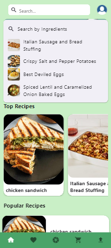
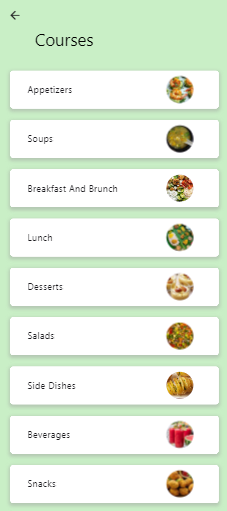

# 🍽️ Foodie Buddy
**Foodie Buddy** is your intelligent recipe companion app designed to help users discover, save, and even generate unique recipes based on available ingredients. Built with Flutter and powered by Firebase and AI, Foodie Buddy simplifies meal planning and makes cooking fun and personalized.

---

## ✨ Features
- 🔍 **Ingredient-Based Search** – Discover recipes based on what's in your kitchen.
- 🧠 **AI-Generated Recipes** – Generate smart, creative recipes with the help of AI.
- 📋 **Grocery List Generator** – Create and manage shopping lists effortlessly.
- 💾 **Save Your Favorites** – Bookmark and organize your favorite meals.

---

## 🛠️ Tech Stack
- **Flutter** – Cross-platform mobile development.
- **Firebase**
  - Authentication
  - Firestore (real-time database)

---

## 🚀 Getting Started

### Prerequisites
- Flutter SDK installed ([Install Flutter](https://docs.flutter.dev/get-started/install))
- Dart SDK
- Firebase account/project
- IDE: Android Studio, VSCode, or IntelliJ

### Installation

1. **Clone the repository**
   ```bash
   git clone https://github.com/AbinVarghese1/Foodie-Buddy.git
   ```

2. **Install Flutter packages**
   ```bash
   flutter pub get
   ```

3. **Firebase Setup**
   - Create a Firebase project at Firebase Console
   - Enable Firestore, Authentication, and Storage (if needed)
   - Add google-services.json to android/app/

4. **Run the app**
   ```bash
   flutter run
   ```

---

## 📸 Screenshots
| Signup Page | Homepage |
|-------------|----------|
|  |  |

| Search | Courses |
|--------|---------|
|  |  |
